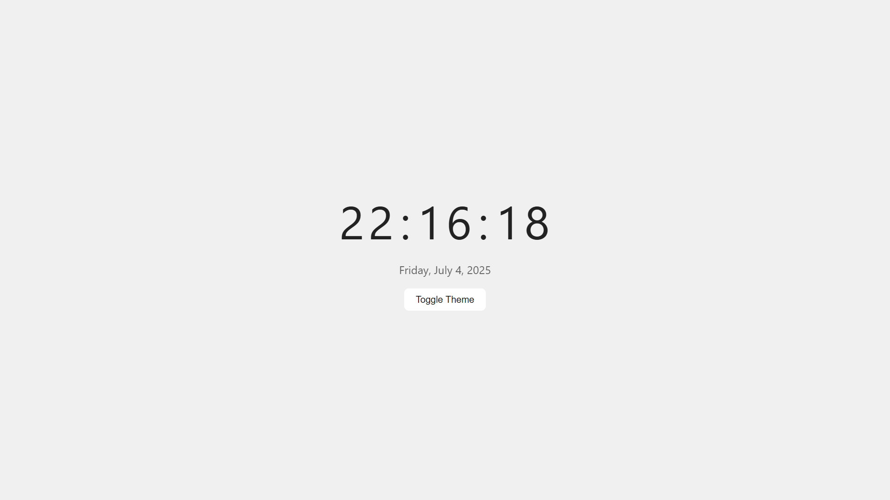
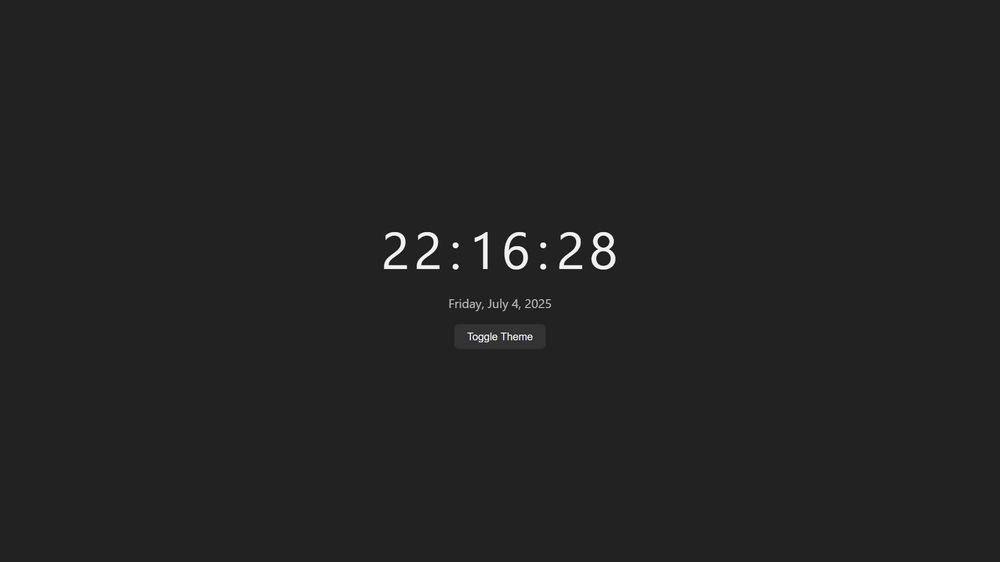

# ⏰ 04 - Simple Web Projects: Digital Clock (HTML, CSS, JavaScript)


This is the fourth project in the **Simple Web Projects** series — a beautifully animated **Digital Clock** built using **HTML, CSS, and vanilla JavaScript**.

---

## ✨ Features

- Live updating digital clock (`HH:MM:SS`)
- Displays current date in full format
- Smooth **3D per-digit flip animation**
- Optional **tick sound** every second
- Dark/light mode toggle
- Fully responsive and clean UI

---

## 📸 Screenshots

### Light Mode  


### Dark Mode  


---

## 🚀 Getting Started

1. **Clone this repository**
   ```bash
   git clone https://github.com/vishal-git-dot/04-simple-web-projects-html-css-js.git
   ```

2. **Navigate to the folder**
   ```bash
   cd 04-digital-clock-html-css-js
   ```

3. **(Optional) Add a Tick Sound**
   - Download or record a `tick.mp3` sound
   - Place it in the root folder with your `index.html`

4. **Open `index.html`** in your browser

---

## 🧠 JavaScript Concepts Used

| Concept                 | Description                                      |
|-------------------------|--------------------------------------------------|
| `Date` object           | To get current hours, minutes, seconds, and date|
| `setInterval()`         | To update the time every second                 |
| `DOM manipulation`      | Update each digit individually                  |
| `classList.toggle()`    | Light/Dark mode switching                       |
| `Audio API`             | Optional tick sound                             |

---

## 📚 Project Series Overview

| #   | Project Name              | Skills                                   | Features                                               |
|-----|---------------------------|------------------------------------------|--------------------------------------------------------|
| ✅ 01 | To-Do List App          | DOM manipulation, event handling, localStorage | Add/edit/delete, mark complete                    |
| ✅ 02 | Calculator              | JavaScript logic, CSS grid               | Basic arithmetic, responsive layout                   |
| ✅ 03 | Weather App             | Fetch API, async/await                   | City search, weather data, unit toggle                |
| ✅ 04 | Digital Clock           | Date object, per-digit animation         | Live clock, 3D flip, sound, theme toggle              |
| 🔜 05 | Quiz App                | Arrays, DOM, event handling              | MCQ quiz, score tracker, category filters             |
| 🔜 06 | Image Slider/Carousel   | CSS transitions, DOM updates             | Auto-slide, manual control, indicators                |
| 🔜 07 | Portfolio Website       | Responsive design, layout                | About, Projects, Contact sections                     |
| 🔜 08 | Typing Speed Test       | Timers, string comparison, DOM updates   | Random text, live WPM, accuracy                       |
| 🔜 09 | Notes App               | localStorage, event handling             | Add/delete notes, save data across sessions           |
| 🔜 10 | Rock, Paper, Scissors   | Random logic, conditionals               | Play vs. computer, show result, track score           |

---

## 🛠️ Built With

- [HTML5](https://developer.mozilla.org/en-US/docs/Web/Guide/HTML/HTML5)
- [CSS3](https://developer.mozilla.org/en-US/docs/Web/CSS)
- [JavaScript](https://developer.mozilla.org/en-US/docs/Web/JavaScript)

---

## 🤝 Contributing

Feel free to fork this repo, make improvements, and open a pull request.  
If you like this project, consider giving it a ⭐ on GitHub!

---

Made with ⏳ by a self-taught developer on a web journey.
